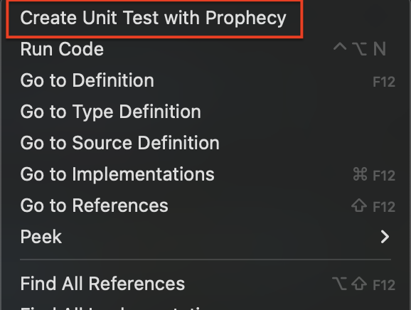

# Prophecy Extension for Visual Studio Code

## What is Prophecy?

**Prophecy** is an extension for **Visual Studio Code** that simplifies the process of creating unit tests for your TypeScript code. With a simple right-click, you can automatically generate unit tests for `.ts` files in your workspace.

---

## How to Use

### Step 1: Install the Extension

1. Go to the **Visual Studio Code Marketplace**.
2. Search for **Prophecy** or [click here to install](https://marketplace.visualstudio.com/items?itemName=prophecyCore.prophecy).
3. Click "Install".

---

### Step 2: Generate Unit Tests

1. Open a TypeScript `.ts` file in your project.
2. Right-click on the code inside the file.
3. In the context menu, select the **"Generate Unit Test with Prophecy"** option.
   
   

4. The test will be generated in the same folder as the original file.

   **Example**:
   - Original file: `src/app/example.ts`
   - Generated test: `src/app/example.spec.ts`

---

### Step 3: Run the Tests

1. After generating the test, you can run the tests using the **Test Runner** in Visual Studio Code or another testing tool of your choice (e.g., Jest, Mocha).

---

## Features

- **Automatic generation of unit tests** for functions in TypeScript files.
- **Creation of test files** in the same folder as the original file.
- Support for **typing and integration** with popular testing tools.

---

## Contributing

This is an **open-source** project. If you'd like to contribute, feel free to submit *pull requests* or report issues.

**Repository link**: [https://github.com/prophecyCore](https://github.com/prophecyCore)

If you find a bug or have suggestions for improvements, feel free to open an **issue** on our GitHub repository.

---

## License

Distributed under the MIT License. See the [LICENSE](LICENSE) file for more details.

---

## Open Source Badge

